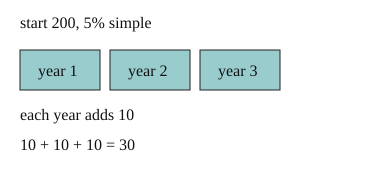

# 02 Simple interest

Part of [Compound Interest](goal.md). Add `sure` or `guess` after any answer, and say `done` when finished.

## Your guess

Last time: 200 at 5% simple interest. How much interest in 3 years? You said **c) 10**. It is **b) 30**.

- a) 15 is 5% of 300, not of 200.
- b) 30: 5% of 200 is 10, once for each of 3 years.
- c) 10 is one year of interest.
- d) 600 multiplies 200 by 3.

## The idea

A bank pays you for keeping money there, and you want to know how much. With simple interest, every year pays the same amount: the rate times the principal, the amount you start with (notes 1). Over n years:

$$
\text{interest} = P \times r \times n
$$

## Questions

**Q1.** 800 at 3% simple interest for 4 years. How much interest?

Answer: 96

> **Feedback:** Right: 0.03 × 800 = 24 a year, and 4 years make 96 (notes 1).

**Q2.** 1500 at 4% simple interest for 2 years. How much is in the account at the end?

Answer: 1500 x 0.04 = 60, two years is 120, so 1620

> **Feedback:** You wrote "1500 x 0.04 = 6". Look at that step: what is 1% of 1500? (notes 1)

> **Feedback:** Right: 60 a year, 120 in all, so 1620 (notes 1).

**Q3.** Mia says 10% simple interest doubles your money in 5 years. What is wrong?

Answer: each year only adds 10% of the start, so 5 years adds 50%. It takes 10 years to double

> **Feedback:** Right: the same 10% of the start each year (notes 1).

You can now work out simple interest over any number of years.

## Guess for next time (not graded)

400 earns 10% a year, and each year's interest is added before the next year's is worked out. How much is there after 2 years?

- a) 480
- b) 484
- c) 440
- d) 800

Answer: a (guess)
