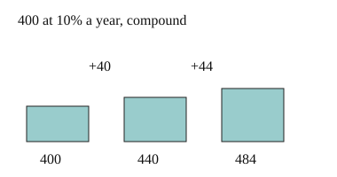

# 03 Compounding year by year

Part of [Compound Interest](goal.md). Add `sure` or `guess` after any answer, and say `done` when finished.

## Your guess

Last time: 400 at 10% a year, each year's interest added before the next. How much after 2 years? You said **a) 480**. It is **b) 484**.

- a) 480 adds 40 twice, as simple interest does.
- b) 484: 400 grows to 440, then 10% of 440 is 44.
- c) 440 stops after one year.
- d) 800 doubles the 400.

## The idea

In the second year, the 40 you earned is in the account too, so it should earn interest as well. Compound interest works each year out on the amount you have now (notes 2). One year at rate r multiplies the amount by 1 + r (notes 3):

$$
A_{\text{next}} = A \times (1 + r)
$$

## Questions

**Q1.** 2000 earns 5% a year, compound. How much is there after 3 years?

Answer: 2000 x 1.05 = 2100, then 2100 x 1.05 = 2205, then 2205 x 1.05 = 2315.25 (sure)

**Q2.** In your own words: why does compound interest give more than simple interest at the same rate, once you are past the first year?

Answer: from the second year on, the interest is also worked out on the interest you already earned, so every year adds a bit more than the last

**Q3.** Jo says 1000 at 5% compound for 2 years gives 1100, since 5% twice is 10%. What is wrong?

Answer: the second 5% is of 1050, not 1000, so it adds 52.50 and the total is 1102.50

## Guess for next time (not graded)

500 grows 20% a year, compound, for 3 years. Which one line gives the amount at the end?

- a) 500 × 1.6
- b) 500 × 1.2³
- c) 500 × 1.2 × 3
- d) 500 × 0.2³

Answer: a (guess)
