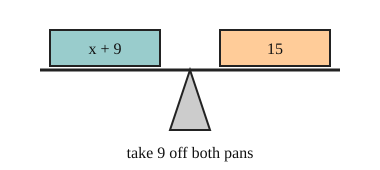

# 02 One-step equations

Part of [Solving Two-Step Equations](goal.md). Add `sure` or `guess` after any answer, and say `done` when finished.

## Your guess

Last time: x + 9 = 15. What is x? You said **b) 6**, and it is.

- a) 24 adds the 9 instead of taking it away.
- b) 6: take 9 from both sides, and 15 - 9 = 6.
- c) 9 reads off the number next to x.
- d) 15 reads off the right side.

## The idea

You want x alone, but something has been done to it. An equation is a balance, so whatever you do to one side you must do to the other (notes 1). Pick the step that undoes what was done to x: subtract undoes add, divide undoes multiply (notes 2, 3).

## Questions

**Q1.** x - 4 = 11. What is x?

Answer: 15 (sure)

> **Feedback:** Right: add 4 to both sides, 11 + 4 = 15 (notes 3).

**Q2.** In your own words: why must you do the same step to both sides?

Answer: the two sides are equal, like a balance, so if I only change one side they stop being equal

> **Feedback:** Right: the balance only stays level if both sides change the same way (notes 1).

**Q3.** Ali says x / 2 = 8 means x = 4, since you halve the 8. What is wrong?

Answer: dividing is undone by multiplying, so x = 8 x 2 = 16, and 16 / 2 = 8 checks (sure)

> **Feedback:** Right: multiply undoes divide, and your check puts 16 back in (notes 3, 6).

You can now solve a one-step equation.

## Guess for next time (not graded)

3x + 5 = 20. What is x?

- a) 15
- b) 5
- c) 25
- d) 75

Answer: b (guess)
