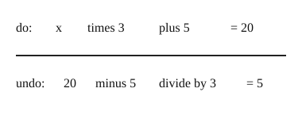

# 03 Two steps in reverse order

Part of [Solving Two-Step Equations](goal.md). Add `sure` or `guess` after any answer, and say `done` when finished.

## Your guess

Last time: 3x + 5 = 20. What is x? You said **b) 5**, and it is.

- a) 15 takes off the 5 but stops before the times 3.
- b) 5: take 5 from both sides to get 3x = 15, then divide by 3.
- c) 25 adds the 5 instead of taking it away.
- d) 75 adds 5, then multiplies by 3.

## The idea

Two things were done to x, so you need two undo steps, and the order matters. Like taking off shoes and then socks, you undo the last step first: in 3x + 5 = 20 the + 5 came last, so it goes first (notes 4).

## Questions

**Q1.** 4x + 3 = 27. What is x?

Answer: 6 (sure)

> **Feedback:** Right: 4x = 24, then x = 6 (notes 4).

**Q2.** In your own words: why undo the + 3 before the times 4?

Answer: the + 3 was done last, so it is on the outside, and you have to take it off before you can get at the 4x

> **Feedback:** Right: undo the last step first (notes 4).

**Q3.** Bo says 2x - 6 = 10 gives x = 2, since 10 - 6 = 4 and 4 / 2 = 2. What is wrong?

Answer: the 6 was taken away, so you add it back: 2x = 16, x = 8 (sure)

> **Feedback:** Right: add undoes subtract, and 2 x 8 - 6 = 10 checks (notes 2, 6).

You can now solve ax + b = c by undoing in reverse order.
