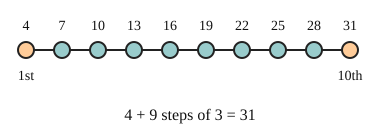

# 02 The nth term

Part of [Arithmetic Sequences](goal.md). Add `sure` or `guess` after any answer, and say `done` when finished.

## Your guess

Last time: 4, 7, 10, 13, ... keeps adding 3. What is its 10th term? You said **b) 34**. It is **a) 31**.

- a) 31: the first term, 4, plus 9 steps of 3.
- b) 34 adds 10 steps, one for every term, the first one too.
- c) 30 counts 10 steps of 3 and leaves out the first term.
- d) 27 counts 9 steps of 3 and leaves out the first term.

## The idea

To jump to a far term, you do not want to list every term on the way. The first term is there before any step, so the 2nd term has had 1 step, the 3rd has had 2, and the nth has had n - 1 (notes 2):

$$
a + (n - 1)d
$$

## Questions

**Q1.** What is the 25th term of 6, 11, 16, ...?

Answer: 126 (sure)

> **Feedback:** Right: 6 plus 24 steps of 5 (notes 2).

**Q2.** A sequence starts at 50 and takes 3 off each time. What is its 12th term?

Answer: 17 (sure)

> **Feedback:** Right: 11 steps of -3 from 50 (notes 1, 2).

**Q3.** Sam says the 8th term of 2, 5, 8, ... is 2 + 8 x 3 = 26. What is wrong?

Answer: the first term is 2 with no step yet, so the 8th term has only had 7 steps: 2 + 7 x 3 = 23 (sure)

> **Feedback:** Right: the first term takes no step, so the 8th has n - 1 = 7 (notes 2).

You can now find any term of an arithmetic sequence.

## Guess for next time (not graded)

How many terms are in 3, 7, 11, ..., 43?

- a) 10
- b) 11
- c) 40
- d) 12

Answer: b (guess)
