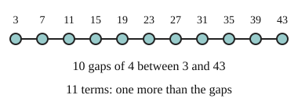

# 03 Counting terms

Part of [Arithmetic Sequences](goal.md). Add `sure` or `guess` after any answer, and say `done` when finished.

## Your guess

Last time: how many terms are in 3, 7, 11, ..., 43? You said **b) 11**, and it is.

- a) 10 counts the steps, (43 - 3) / 4, not the terms.
- b) 11: 10 steps of 4, plus the first term, which takes no step.
- c) 40 is the distance from 3 to 43.
- d) 12 adds one term at each end.

## The idea

To use the nth term you often need n, and listing every term to count them is slow. The distance from the first term to the last is made of whole steps, so (last - first) / d counts the steps (notes 3). Each step lands on a new term, and the first term was there before any step, so add one (notes 4):

$$
n = \frac{\text{last} - \text{first}}{d} + 1
$$

## Questions

**Q1.** How many terms are in 7, 11, 15, ..., 143?

Answer: 35 (sure)

**Q2.** The sequence 18, 25, 32, ... keeps adding 7. Which term is 200?

Answer: the 26th (sure)

**Q3.** Ana says 10, 15, 20, ..., 60 has 10 terms, since (60 - 10) / 5 = 10. What is wrong?

Answer: (60 - 10) / 5 = 10 counts the steps between terms. 10 is already a term before any step, so there are 11 (sure)

## Guess for next time (not graded)

What is 2 + 4 + 6 + ... + 20?

- a) 110
- b) 100
- c) 220
- d) 121

Answer: b (guess)
