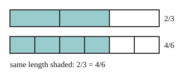

# 02 Equal fractions

Part of [Adding Fractions](goal.md). Add `sure` or `guess` after any answer, and say `done` when finished.

## Your guess

Last time: which fraction is equal to 2/3? You said **b) 3/4**. It is **a) 4/6**.

- a) 4/6: top and bottom both times 2, so each third is cut in two.
- b) 3/4 adds 1 to the top and to the bottom.
- c) 4/5 adds 2 to the top and to the bottom.
- d) 2/6 multiplies only the bottom by 2.

## The idea

Cut each piece of a fraction into 2 and you get twice as many pieces, each half the size, so the amount stays the same. That is why multiplying the top and the bottom by the same number gives an equal fraction (notes 2). Dividing both by a common factor goes the other way and simplifies it.

## Questions

**Q1.** Fill in the top: 3/5 = ?/20

Answer: 12

> **Feedback:** Right: 5 x 4 = 20, so the top is 3 x 4 = 12 (notes 2).

**Q2.** Simplify 18/24.

Answer: 3/4 (guess)

> **Feedback:** Right: 6 goes into both, 18/6 = 3 and 24/6 = 4 (notes 2).

**Q3.** Mo says 2/3 and 3/4 are equal, since each top is one less than its bottom. What is wrong?

Answer: equal fractions come from multiplying top and bottom by the same number. Over 12, 2/3 is 8/12 and 3/4 is 9/12, so 3/4 is bigger

> **Feedback:** Right: over the same bottom they differ by one twelfth (notes 2).

You can now write a fraction over a new bottom, or simplify it.

## Guess for next time (not graded)

What is 1/3 + 1/4?

- a) 2/7
- b) 7/12
- c) 2/12
- d) 1/12

Answer: a (guess)
