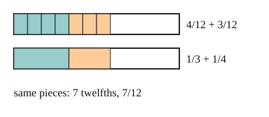

# 03 Different bottoms

Part of [Adding Fractions](goal.md). Add `sure` or `guess` after any answer, and say `done` when finished.

## Your guess

Last time: what is 1/3 + 1/4? You said **a) 2/7**. It is **b) 7/12**.

- a) 2/7 adds the tops and adds the bottoms.
- b) 7/12: 1/3 is 4/12 and 1/4 is 3/12, so 7 twelfths.
- c) 2/12 adds the tops and multiplies the bottoms.
- d) 1/12 multiplies the two fractions.

## The idea

Thirds and fourths are pieces of different sizes, so their tops cannot be added as they stand (notes 3). Cut both into pieces of one size first. 12 is a multiple of 3 and of 4, so 1/3 = 4/12 and 1/4 = 3/12 (notes 2). Now the pieces match:

$$
\frac{1}{3} + \frac{1}{4} = \frac{4}{12} + \frac{3}{12} = \frac{7}{12}
$$

Any common multiple of the bottoms works; the least one keeps the numbers small (notes 4).

## Questions

**Q1.** What is 2/5 + 1/3?

Answer: 6/15 + 5/15 = 11/15 (sure)

**Q2.** What is 3/4 - 1/6?

Answer: 3/4 = 18/24 and 1/6 = 4/24, so 18/24 - 4/24 = 14/24 (sure)

**Q3.** Jo says 1/2 + 1/3 = 2/5, adding tops and adding bottoms. In your own words, what is wrong?

Answer: halves and thirds are different sized pieces, so you cannot just count them together. Over sixths it is 3/6 + 2/6 = 5/6. And 2/5 is less than 1/2, so it cannot be 1/2 plus something more

## Guess for next time (not graded)

What is 1 1/2 + 2 2/3?

- a) 3 3/5
- b) 4 1/6
- c) 3 1/6
- d) 3 2/6

Answer: c
