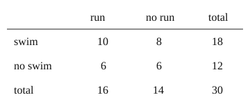

# 02 Two-way tables

Part of [Reading Probabilities From Counts](goal.md). Add `sure` or `guess` after any answer, and say `done` when finished.

## Your guess

Last time: 30 members, 18 swim, 10 of them also run, 6 run but do not swim. How many do neither? You said **a) 6**. It is **a) 6**.

- a) 6: the 12 who do not swim, less the 6 of them who run.
- b) 2 takes 10 and 18 from 30.
- c) 12 counts everyone who does not swim.
- d) 8 counts swimmers who do not run.

## The idea

Two yes-or-no questions split a group four ways, and each person lands in one cell (notes 1). So rows and columns add up to totals, and a missing cell can be found from the others.

## Questions

**Q1.** 50 students: 20 take art, 12 of those also take music, and 25 take music in all. How many take music but not art?

Answer: 13

> **Feedback:** Right: 25 music students, 12 of them in art (notes 1).

**Q2.** Same school. How many take neither?

Answer: 17

> **Feedback:** Right: 50 - 20 - 13 = 17 (notes 1).

**Q3.** Kim says the four cells can add up to more than 50, since some students take both. What is wrong?

Answer: each student is in exactly one cell, the both cell counts them once, so the cells add to 50

> **Feedback:** Right: one cell per person (notes 1).

You can now fill in a two-way table from partial counts.

## Guess for next time (not graded)

Same school. Of the students who take music, what fraction also take art?

- a) 12/20
- b) 12/25
- c) 12/50
- d) 25/50

Answer: b (sure)
