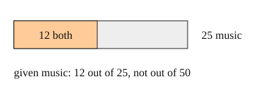

# 03 Reading given

Part of [Reading Probabilities From Counts](goal.md). Add `sure` or `guess` after any answer, and say `done` when finished.

## Your guess

Last time: of the 25 music students, what fraction also take art? You said **b) 12/25**, and it is.

- a) 12/20 divides by the art students instead.
- b) 12/25: the music students are the group, and 12 of them take art.
- c) 12/50 divides by the whole school.
- d) 25/50 is the share who take music.

## The idea

Often you learn one thing about a person and want to update. "Given music" means: forget everyone else, and treat the 25 music students as the whole (notes 3). Then count how many of them have the other trait:

$$
P(\text{art given music}) = \frac{\text{both}}{\text{music}} = \frac{12}{25}
$$

## Questions

**Q1.** In a class of 40, 12 play chess. 3 of those 12 also play piano, and 8 students play piano in all. What fraction of the chess players play piano?

Answer: 3/12 = 1/4 (sure)

> **Feedback:** Right: the 12 chess players are the group, and 3 of them play piano (notes 3).

**Q2.** Same class. What is P(chess given piano)?

Answer: still 3/12, both questions are about the same 3 people who do both, so the fraction has to match (sure)

> **Feedback:** You wrote "the same as piano given chess". Both use the 3 who do both, but "given" picks the group you divide by (notes 3). Which group does "given piano" pick, and how many are in it?

**Q3.** In your own words: why does P(A given B) divide by the number with B and not by the whole group?

Answer: given B means we only look at the B group, so the B group becomes the new whole

> **Feedback:** Right: "given B" shrinks the whole to the B group (notes 3).

## Guess for next time (not graded)

1 in 100 people in a town has a rare cold. A test catches 9 in 10 of the people who have it, but also flags 1 in 10 of the people who do not. Of the people the test flags, about what share have the cold?

- a) 90%
- b) 9%
- c) 50%
- d) 1%

Answer: a (guess)
