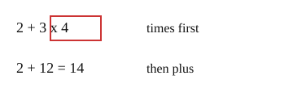

# 02 Times before plus

Part of [Order of Operations](goal.md). Add `sure` or `guess` after any answer, and say `done` when finished.

## Your guess

Last time: what is 2 + 3 x 4? You said **a) 20**. It is **b) 14**.

- a) 20 adds first, then multiplies.
- b) 14: 3 x 4 = 12 first, then 2 + 12.
- c) 24 multiplies all three numbers.
- d) 9 adds all three numbers.

## The idea

One expression should mean one number to everyone, so there is a fixed order. Multiply and divide go before add and subtract (notes 2). In 2 + 3 x 4, the x 4 belongs to the 3 only.

## Questions

**Q1.** What is 10 - 2 x 3?

Answer: 4 (sure)

> **Feedback:** Right: 2 x 3 = 6 first, then 10 - 6 = 4 (notes 2).

**Q2.** In your own words: why is 5 + 2 x 3 not 21?

Answer: the x 3 only belongs to the 2, so you do 2 x 3 = 6 first and then add 5, which is 11

> **Feedback:** Right: the times binds to the 2 alone (notes 2).

**Q3.** Lu says 20 - 12 / 4 = 2, working from the left. What is wrong?

Answer: divide comes before subtract, so 12 / 4 = 3 first, then 20 - 3 = 17 (sure)

> **Feedback:** Right: divide goes before subtract (notes 2).

You can now do x and / before + and -.

## Guess for next time (not graded)

What is 12 / 3 x 2?

- a) 2
- b) 8
- c) 4
- d) 24

Answer: c (guess)
