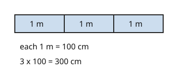

# 02 To a smaller unit

Part of [Metric Conversions](goal.md). Add `sure` or `guess` after any answer, and say `done` when finished.

## Your guess

Last time: how many centimetres are in 3 m? You said **c) 300**, and it is.

- a) 0.03 divides by 100 instead of multiplying.
- b) 30 uses 10 cm in a metre.
- c) 300: each of the 3 metres holds 100 cm.
- d) 3000 uses 1000 cm in a metre.

## The idea

You measured in metres, but the form wants centimetres. A centimetre is smaller, so you need more of them: each metre holds 100, so multiply by 100 (notes 3). The number grows because the unit shrank.

## Questions

**Q1.** How many millimetres are in 7 cm?

Answer: 70

> **Feedback:** Right: each cm holds 10 mm, so 7 x 10 = 70 (notes 1, 3).

**Q2.** How many centimetres are in 9 m?

Answer: 900 (guess)

> **Feedback:** Right: 9 x 100 = 900 (notes 1, 3).

**Q3.** Kai says 4 m is 0.04 cm, since you divide by 100 to get centimetres. What is wrong?

Answer: cm are smaller, so there have to be more of them, not fewer. You multiply, 4 x 100 = 400 cm

> **Feedback:** Right: a smaller unit means a bigger number (notes 3).

You can now change to a smaller unit.

## Guess for next time (not graded)

How many metres are in 450 cm?

- a) 45,000
- b) 4.5
- c) 45
- d) 0.45

Answer: b (guess)
