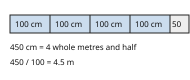

# 03 To a bigger unit

Part of [Metric Conversions](goal.md). Add `sure` or `guess` after any answer, and say `done` when finished.

## Your guess

Last time: how many metres are in 450 cm? You said **b) 4.5**, and it is.

- a) 45,000 multiplies by 100 instead of dividing.
- b) 4.5: every 100 cm make one metre, and 450 / 100 = 4.5.
- c) 45 divides by 10, as if 10 cm made a metre.
- d) 0.45 divides by 1000, as if 1000 cm made a metre.

## The idea

Going the other way, the bigger unit swallows many small ones, so you need fewer of them. Divide by how many small units fit in one big one (notes 4): 450 cm / 100 = 4.5 m.

## Questions

**Q1.** How many metres are in 2600 mm?

Answer: 2.6

> **Feedback:** Right: 2600 / 1000 = 2.6 (notes 1, 4).

**Q2.** How many centimetres are in 85 mm?

Answer: 8.5 (sure)

> **Feedback:** Right: 10 mm make a cm, so 85 / 10 = 8.5 (notes 1, 4).

**Q3.** Lu says to change 500 m to km you multiply by 1000, since a km has 1000 m. What is wrong?

Answer: a km is the bigger unit, so you need fewer of them. Divide: 500 / 1000 = 0.5 km

> **Feedback:** Right: to a bigger unit, divide (notes 4).

You can now change to a bigger unit.

## Guess for next time (not graded)

How many milligrams are in 1 gram?

- a) 10
- b) 100
- c) 1000
- d) 1,000,000

Answer: b (sure)
