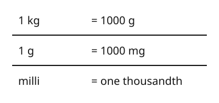

# 04 Mass units

Part of [Metric Conversions](goal.md). Add `sure` or `guess` after any answer, and say `done` when finished.

## Your guess

Last time: how many milligrams are in 1 gram? You said **b) 100**. It is **c) 1000**.

- a) 10 is the number of mm in a cm.
- b) 100 reads milli as one hundredth, which is centi.
- c) 1000: milli means one thousandth, so 1000 mg make a gram.
- d) 1,000,000 multiplies by 1000 twice.

## The idea

You can already change metres and centimetres. Masses use the gram, with the same prefixes, so nothing new to learn but two facts: kilo means 1000 and milli one thousandth (notes 1, 2). So 1 kg = 1000 g and 1 g = 1000 mg, and the multiply or divide rules work as before.

## Questions

**Q1.** How many grams are in 1.2 kg?

Answer: 1200 (sure)

> **Feedback:** Right: 1.2 x 1000 = 1200 (notes 2, 3).

**Q2.** How many grams are in 3600 mg?

Answer: 3.6

> **Feedback:** Right: 1000 mg make a gram, so 3600 / 1000 = 3.6 (notes 2, 4).

**Q3.** Ben says 1 kg is 100 g, since kilo is like centi. What is wrong?

Answer: kilo means 1000, so 1 kg is 1000 g. Centi is a hundredth, so it makes things smaller, not bigger

> **Feedback:** Right: kilo is 1000 of the unit, centi one hundredth of it (notes 1, 2).

You can now change between kg, g and mg.

## Guess for next time (not graded)

A run is 2.5 km long. How many centimetres is that?

- a) 2500
- b) 25,000
- c) 250,000
- d) 0.025

Answer: a (sure)
