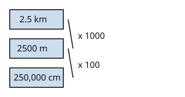

# 05 Two steps at once

Part of [Metric Conversions](goal.md). Add `sure` or `guess` after any answer, and say `done` when finished.

Help is down to 2, since you passed 03 and 04 first try: an outline and a picture, no worked example.

## Review

**R1.** How many centimetres are in 6 m?

Answer: 6 x 100 = 60 (sure)

**R2.** How many metres are in 720 cm?

Answer: 72,000, there are 100 cm in a metre so you times by 100 (sure)

## Your guess

Last time: a run is 2.5 km long. How many centimetres is that? You said **a) 2500**. It is **c) 250,000**.

- a) 2500 stops at metres.
- b) 25,000 uses 10 cm in a metre.
- c) 250,000: x 1000 to get metres, then x 100 to get centimetres.
- d) 0.025 divides by 100 instead of multiplying.

## The idea

Your 2500 is right, but it is in metres. Km to cm crosses two steps, so take both (notes 5):

- 2.5 km x 1000 = 2500 m
- 2500 m x 100 = 250,000 cm

Or multiply the factors first: a km holds 1000 x 100 = 100,000 cm, and 2.5 x 100,000 = 250,000.

## Questions

**Q1.** A path is 0.4 km long. How long is it in centimetres?

Answer: 40,000 (sure)

**Q2.** In your own words: why can you multiply 1000 by 100 and go straight from km to cm?

Answer: each km is 1000 m and each of those metres is 100 cm, so one km is 1000 lots of 100 cm, which is 100,000 cm (guess)

**Q3.** Mia says 60,000 mm is 60 km, since milli and kilo both mean 1000. What is wrong?

Answer: milli is a thousandth of a metre and kilo is 1000 metres, so mm to km is two steps. 60,000 / 1000 = 60 m, then 60 / 1000 = 0.06 km
