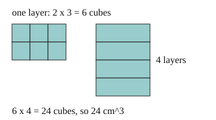

# 02 Volume of a box

Part of [Density](goal.md). Add `sure` or `guess` after any answer, and say `done` when finished.

## Your guess

Last time: how many 1 cm cubes fill a 2 cm by 3 cm by 4 cm box? You said **a) 9**. It is **b) 24**.

- a) 9 adds the three side lengths.
- b) 24: 2 x 3 = 6 cubes in each layer, and 4 layers.
- c) 52 counts the squares on the outside.
- d) 12 multiplies only two of the sides.

## The idea

You want to know how much space a box takes up. Fill it with 1 cm cubes: one layer holds length x width of them, and there are as many layers as the box is high. So the volume is length x width x height, in cm^3 (notes 2).

## Questions

**Q1.** A box is 5 cm by 2 cm by 3 cm. What is its volume, in cm^3?

Answer: 30

> **Feedback:** Right: 5 x 2 x 3 = 30 (notes 2).

**Q2.** A cube has sides of 4 cm. What is its volume, in cm^3?

Answer: 12 (sure)

> **Feedback:** You wrote "12". That is 4 + 4 + 4. Build it in layers: one layer is 4 x 4 cubes. How many layers does a 4 cm cube have? (notes 2)

Answer: 64

> **Feedback:** Right: 16 cubes in a layer, 4 layers, 64 cm^3 (notes 2).

**Q3.** In your own words: why do you multiply the sides and not add them?

Answer: each layer is length x width cubes and the height says how many layers, so it is a count of cubes not a length

> **Feedback:** Right: the volume counts cubes, layer by layer (notes 2).

You can now find the volume of a box.

## Guess for next time (not graded)

A block is 2 cm by 2 cm by 5 cm and has a mass of 50 g. How many grams is each cubic centimetre of it?

- a) 0.4
- b) 2.5
- c) 50
- d) 1000

Answer: c (guess)
