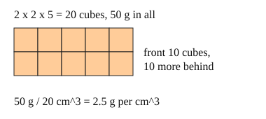

# 03 Density

Part of [Density](goal.md). Add `sure` or `guess` after any answer, and say `done` when finished.

## Your guess

Last time: a 2 cm by 2 cm by 5 cm block has a mass of 50 g. How many grams is each cubic centimetre? You said **c) 50**. It is **b) 2.5**.

- a) 0.4 divides the volume by the mass.
- b) 2.5: 50 g shared among 20 cm^3.
- c) 50 is the mass of the whole block.
- d) 1000 multiplies the mass by the volume.

## The idea

Is a gold ring heavier than a gold bar? Yes, but the gold is the same stuff. To compare materials, not objects, share the mass among the cubic centimetres: density is mass divided by volume, $D = m / V$, in g/cm^3 (notes 3). It does not change with the size of the piece (notes 4).

$$
D = \frac{50 \text{ g}}{20 \text{ cm}^3} = 2.5 \text{ g/cm}^3
$$

## Questions

**Q1.** A stone has a volume of 50 cm^3 and a mass of 135 g. What is its density, in g/cm^3?

Answer: 2.7

**Q2.** In your own words: why does a small piece of steel have the same density as a big piece of the same steel?

Answer: if the piece is twice as big it has twice the mass and twice the volume, so mass divided by volume comes out the same

**Q3.** Sam says a 1 kg block of wood is denser than a 100 g iron nail, because it has more mass. What is wrong?

Answer: density is mass per cm^3, not the total mass. the wood block takes up far more space, so each cm^3 of it has less mass than each cm^3 of the nail

## Guess for next time (not graded)

A block has a volume of 10 cm^3 and a mass of 8 g. You drop it in water. What happens?

- a) it sinks to the bottom
- b) it floats
- c) it stays wherever you let go
- d) it sinks, then comes back up

Answer: a (guess)
