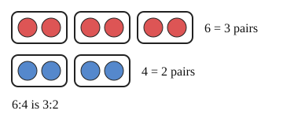

# 02 Equal ratios

Part of [Ratios](goal.md). Add `sure` or `guess` after any answer, and say `done` when finished.

## Your guess

Last time: which ratio is the same as 6:4? You said **a) 3:2**, and it is.

- a) 3:2: both sides divided by 2.
- b) 4:6 swaps the two sides.
- c) 5:3 takes 1 from each side.
- d) 12:4 doubles only the first side.

## The idea

A ratio says how two amounts compare, not how big they are (notes 1). Group 6 red and 4 blue into pairs and you get 3 pairs to 2 pairs: the same mix, smaller numbers. So multiplying or dividing both sides by the same number gives an equal ratio (notes 2).

## Questions

**Q1.** Simplify 20:8.

Answer: 5:2

> **Feedback:** Right: 4 goes into both sides (notes 2).

**Q2.** Fill in: 3:7 = 12:?

Answer: 28 (guess)

> **Feedback:** Right: 3 x 4 = 12, so 7 x 4 = 28 (notes 2).

**Q3.** Tia says 2:5 and 4:7 are equal, since she added 2 to both sides. What is wrong?

Answer: adding changes the mix, only multiplying keeps it. 2:5 doubled is 4:10, not 4:7 (sure)

> **Feedback:** Right: equal ratios come from multiplying both sides (notes 2).

You can now simplify a ratio or scale it up.

## Guess for next time (not graded)

Ana and Ben share 20 sweets in the ratio 3:2. How many does Ana get?

- a) 3
- b) 12
- c) 10
- d) 8

Answer: c (guess)
