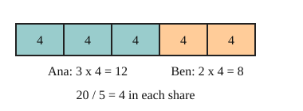

# 03 Sharing in a ratio

Part of [Ratios](goal.md). Add `sure` or `guess` after any answer, and say `done` when finished.

## Your guess

Last time: Ana and Ben share 20 sweets in the ratio 3:2. How many does Ana get? You said **c) 10**. It is **b) 12**.

- a) 3 reads the ratio as the number of sweets.
- b) 12: 5 shares of 4, and Ana gets 3 of them.
- c) 10 splits the sweets evenly.
- d) 8 is Ben's part, not Ana's.

## The idea

3:2 does not mean half each: for every 3 sweets Ana gets, Ben gets 2. So count shares first: 3 + 2 = 5 equal shares (notes 3). One share is 20 / 5 = 4, so Ana gets 3 x 4 = 12 and Ben gets 2 x 4 = 8. They add back to 20, which checks it (notes 4).

## Questions

**Q1.** Share 35 in the ratio 4:3.

Answer: 4 + 3 = 7 shares, 35 / 7 = 5, so 20 and 15 (sure)

**Q2.** Kai and Lu share 65 stickers in the ratio 4:9. How many does Lu get?

Answer:

**Q3.** Sam says sharing 30 in the ratio 2:3 gives 2 and 3. In your own words, what is wrong?

Answer: 2:3 only says how the parts compare, not how many. 2 and 3 add to 5, not 30. There are 5 equal shares of 6, so it is 12 and 18

## Guess for next time (not graded)

A recipe for 4 people uses 300 g of flour. How much flour is needed for 6 people?

- a) 302 g
- b) 450 g
- c) 200 g
- d) 1800 g

Answer: d
