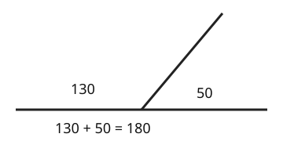

# 02 Angles on a line

Part of [Angle Facts](goal.md). Add `sure` or `guess` after any answer, and say `done` when finished.

## Your guess

Last time: one of two angles on a straight line is 130 degrees. What is the other? You said **a) 50**, and it is.

- a) 50: the two angles make a half turn, and 180 - 130 = 50.
- b) 230 takes 130 from a full turn instead of a half turn.
- c) 130 copies the angle you were given.
- d) 310 adds 130 to 180 instead of taking it away.

## The idea

To find a missing angle you need a total to take from. A straight line is a half turn, so the angles along one side of it add up to 180 degrees (notes 1, 2).

## Questions

**Q1.** On a straight line, one angle is 72 degrees. What is the other?

Answer: 108 (sure)

> **Feedback:** Right: 180 - 72 = 108 (notes 2).

**Q2.** Three angles sit side by side on a straight line: 40, 85 and x. What is x?

Answer: 55 (guess)

> **Feedback:** Right: 40 + 85 = 125, and 180 - 125 = 55 (notes 2).

**Q3.** In your own words: why do angles on a straight line add up to 180?

Answer: a straight line is half a turn, and half a turn is 180 degrees

> **Feedback:** Right: the line is a half turn (notes 1, 2).

You can now find a missing angle on a straight line.

## Guess for next time (not graded)

Four angles meet at a point: 90, 90, 90 and x. What is x?

- a) 0
- b) 90
- c) 180
- d) 270

Answer: b (guess)
