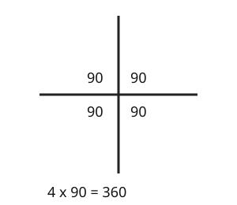

# 03 Angles at a point

Part of [Angle Facts](goal.md). Add `sure` or `guess` after any answer, and say `done` when finished.

## Your guess

Last time: four angles meet at a point, three of them 90 degrees. What is the fourth? You said **b) 90**, and it is.

- a) 0 thinks the three right angles already fill the point.
- b) 90: four right angles fill a full turn, 4 x 90 = 360.
- c) 180 is a half turn, the total on a line.
- d) 270 adds up the three you were given.

## The idea

A straight line gave you 180 to take from. Around a point you go all the way round, a full turn, so the angles add up to 360 degrees (notes 1, 3).

## Questions

**Q1.** Angles of 150, 120 and x meet at a point. What is x?

Answer: 90 (sure)

> **Feedback:** Right: 150 + 120 = 270, and 360 - 270 = 90 (notes 3).

**Q2.** Five equal angles meet at a point. How big is each one?

Answer: 72

> **Feedback:** Right: 360 / 5 = 72 (notes 3).

**Q3.** Zoe says angles around a point add up to 180, like angles on a line. What is wrong?

Answer: a line is only half a turn. Going all the way round a point is a full turn, which is 360

> **Feedback:** Right: half a turn against a full turn (notes 1, 3).

You can now find a missing angle around a point.

## Guess for next time (not graded)

Two straight lines cross. One of the four angles is 40 degrees. What is the angle opposite it?

- a) 40
- b) 140
- c) 320
- d) 50

Answer: b (sure)
