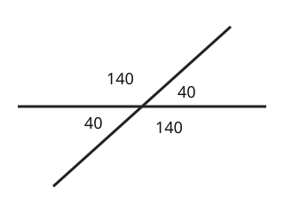

# 04 Crossing lines

Part of [Angle Facts](goal.md). Add `sure` or `guess` after any answer, and say `done` when finished.

## Your guess

Last time: two lines cross and one angle is 40 degrees. What is the angle opposite it? You said **b) 140**. It is **a) 40**.

- a) 40: opposite angles are equal.
- b) 140 is the angle next to it, which makes 180 with it.
- c) 320 takes 40 from a full turn.
- d) 50 takes 40 from a right angle.

## The idea

Your 140 is a real angle there, but it is the one beside the 40: they share a straight line, so they add to 180 (notes 2). The angle across from the 40 also sits on a line with that 140, so it is 180 - 140 = 40 again. Opposite angles are equal (notes 4).

## Questions

**Q1.** Two lines cross and one angle is 65 degrees. What are the other three?

Answer: 115, 65 and 115

> **Feedback:** Right: the two beside it make 180 with it, and the one across is equal to it (notes 4).

**Q2.** In your own words: why are opposite angles equal?

Answer: each of them makes 180 with the same angle between them, so they have to be the same size (guess)

> **Feedback:** Right: both are 180 minus the same angle (notes 2, 4).

**Q3.** Sam says opposite angles add up to 180. What is wrong?

Answer: that is true for angles next to each other on a line. Opposite ones are equal

> **Feedback:** Right: next to each other add to 180, opposite are equal (notes 4).

You can now find every angle where two lines cross.

## Guess for next time (not graded)

A triangle has angles of 50 and 70 degrees. What is the third angle?

- a) 60
- b) 240
- c) 120
- d) 180

Answer: b (guess)
