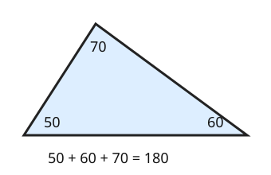

# 05 Angles in a triangle

Part of [Angle Facts](goal.md). Add `sure` or `guess` after any answer, and say `done` when finished.

Help is down to 2, since you said too easy: an outline and a picture, no worked example.

## Your guess

Last time: a triangle has angles of 50 and 70 degrees. What is the third? You said **b) 240**. It is **a) 60**.

- a) 60: the three inside angles add up to 180.
- b) 240 takes 120 from a full turn, 360.
- c) 120 adds the two you were given.
- d) 180 is the total, not the missing angle.

## The idea

Tear the three corners off a paper triangle and set them side by side: they make a straight line. So the inside angles add up to 180, not 360 (notes 5).

## Questions

**Q1.** A triangle has angles of 25 and 110 degrees. What is the third?

Answer: 45 (sure)

> **Feedback:** Right: 25 + 110 = 135, and 180 - 135 = 45 (notes 5).

**Q2.** A right triangle has one other angle of 38 degrees. What is the third?

Answer: 52 (guess)

> **Feedback:** Right: 90 + 38 = 128, and 180 - 128 = 52 (notes 1, 5).

**Q3.** Ali says a triangle can have angles of 100 and 90 degrees. What is wrong?

Answer: 100 + 90 is 190, more than the 180 the whole triangle has, so there is nothing left for the third angle

> **Feedback:** Right: two angles alone would pass 180 (notes 5).

You can now find the third angle of a triangle.

## Guess for next time (not graded)

A triangle has two equal sides, and the angle between them is 40 degrees. How big is each of the other two angles?

- a) 40
- b) 70
- c) 140
- d) 100

Answer: a (sure)
