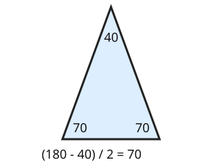

# 06 Isosceles triangles

Part of [Angle Facts](goal.md). Add `sure` or `guess` after any answer, and say `done` when finished.

## Your guess

Last time: two equal sides meet at 40 degrees. How big is each of the other two angles? You said **a) 40**. It is **b) 70**.

- a) 40 makes every angle equal to the top one.
- b) 70: the other two are equal and share 180 - 40 = 140.
- c) 140 gives both of them together.
- d) 100 takes 40 from 140.

## The idea

Two equal sides make the triangle the same on both sides of its middle, so the two base angles are equal (notes 6). The top angle need not match them. Take the top from 180 and halve what is left: (180 - 40) / 2 = 70.

## Questions

**Q1.** An isosceles triangle has base angles of 52 degrees each. What is the top angle?

Answer: 76 (sure)

> **Feedback:** Right: 52 + 52 = 104, and 180 - 104 = 76 (notes 5, 6).

**Q2.** An isosceles triangle has a top angle of 100 degrees. How big is each base angle?

Answer: 40

> **Feedback:** Right: (180 - 100) / 2 = 40 (notes 5, 6).

**Q3.** In your own words: why must each base angle be less than 90?

Answer: the two base angles are equal, so if each was 90 or more they would make 180 or more together, with nothing left for the top

> **Feedback:** Right: two equal base angles share less than 180 (notes 5, 6).

You can now find the missing angles of an isosceles triangle.

## Guess for next time (not graded)

One side of a triangle is extended past a corner. The inside angles at the other two corners are 50 and 60 degrees. What is the outside angle between the extended side and the triangle?

- a) 70
- b) 110
- c) 60
- d) 250

Answer: a (sure)
