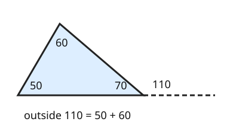

# 07 Outside angles

Part of [Angle Facts](goal.md). Add `sure` or `guess` after any answer, and say `done` when finished.

## Review

**R1.** Three angles meet at a point: 40, 65 and x degrees. What is x?

Answer: 75, angles at a point make 180 like on a straight line (sure)

## Your guess

Last time: a side is extended past a corner, and the other two inside angles are 50 and 60 degrees. What is the outside angle? You said **a) 70**. It is **b) 110**.

- a) 70 is the inside angle at that corner.
- b) 110: the outside angle equals 50 + 60.
- c) 60 copies the nearest inside angle.
- d) 250 goes the long way round, 360 - 110.

## The idea

Your 70 is the inside angle at that corner. The outside angle sits on a straight line with it, so it is 180 - 70 = 110 (notes 2). And since the three inside angles add up to 180 (notes 5), that 110 is just the other two inside angles together: 50 + 60 = 110 (notes 7).

## Questions

**Q1.** A triangle has inside angles of 35 and 80 degrees at two corners. The side at the third corner is extended. What is the outside angle there?

Answer: 115 (sure)

**Q2.** In your own words: why does the outside angle equal the two far inside angles added together?

Answer: the outside angle and the inside angle at that corner make a straight line, so they add to 180. The three inside angles add to 180 too. Both totals share the inside angle at that corner, so what is left must match: the outside angle equals the other two

**Q3.** Raj says an outside angle can be smaller than one of the two far inside angles, like an outside angle of 40 next to a far angle of 70. What is wrong?

Answer: the outside angle is both far angles added, so it is 70 plus something more than 0. It has to be bigger than each far angle
