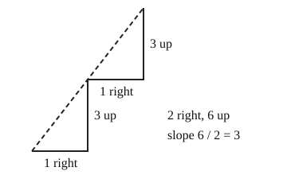

# 02 Slope as rise over run

Part of [Straight Lines From Two Points](goal.md). Add `sure` or `guess` after any answer, and say `done` when finished.

Help is now 3: each lesson traces a worked example before the questions.

## Your guess

Last time: a line goes up 6 while it goes 2 to the right. How far up for each one step right? You said **a) 3**, and it is.

- a) 3: the 6 up shared over 2 steps right.
- b) 12 multiplies the rise by the run.
- c) 1/3 puts the run over the rise.
- d) 4 takes the run away from the rise.

## The idea

To say how steep a line is, you want one number that stays the same however long a piece of the line you look at. Slope is that number: rise over run, how far the line goes up for each one step right (notes 1). A line that goes down to the right has a negative rise, so a negative slope.

$$
m = \frac{\text{rise}}{\text{run}}
$$

Worked example: up 6 over 2 to the right.

- rise: 6
- run: 2
- slope: 6 / 2 = 3

## Questions

**Q1.** A line rises 10 over a run of 5. What is its slope?

Answer: 2

> **Feedback:** Right: 10 / 5 = 2 (notes 1).

**Q2.** A line goes from (0, 0) to (4, 2). What is its slope?

Answer: up 2 for 4 across, so 2/4 = 1/2

> **Feedback:** You wrote "4 across and 2 up, so 4/2 = 2". Trace it one step at a time:
>
> - from x = 0 to x = 2, the line climbs 1
> - from x = 2 to x = 4, it climbs 1 more
>
> So for one step right, how far up does it go? (notes 1)

> **Feedback:** Right: now the rise is on top, 2 up over 4 across (notes 1).

**Q3.** In your own words: why does a line that goes down to the right have a negative slope?

Answer: going right it goes down, so the rise is a minus number, and a minus over a plus is a minus

> **Feedback:** Right: the rise is negative and the run is positive (notes 1).

You can now find a slope from a rise and a run.

## Guess for next time (not graded)

A line goes through (1, 3) and (5, 11). What is its slope?

- a) 2
- b) 1/2
- c) 8
- d) -2

Answer: a (guess)
