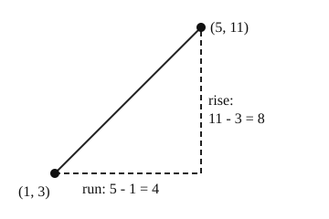

# 03 Slope from two points

Part of [Straight Lines From Two Points](goal.md). Add `sure` or `guess` after any answer, and say `done` when finished.

## Your guess

Last time: what is the slope of the line through (1, 3) and (5, 11)? You said **a) 2**, and it is.

- a) 2: a rise of 11 - 3 = 8 over a run of 5 - 1 = 4.
- b) 1/2 puts the run over the rise.
- c) 8 is the rise alone.
- d) -2 takes the y values in the other order from the x values.

## The idea

With only two points and no grid, you cannot count steps. But the rise is just how much y changed, and the run how much x changed (notes 2):

$$
m = \frac{y_2 - y_1}{x_2 - x_1}
$$

Subtract in the same order on top and bottom. Which point you call first does not matter.

Worked example: (2, 1) and (6, 13).

- rise: 13 - 1 = 12
- run: 6 - 2 = 4
- slope: 12 / 4 = 3

## Questions

**Q1.** What is the slope of the line through (1, 2) and (4, 11)?

Answer: 3

**Q2.** In your own words: for (-2, 5) and (2, -3), why do you get the same slope whichever point you call first?

Answer: swapping the points flips the sign of both the top and the bottom, -8/4 or 8/-4, so the two minus signs cancel out and it is -2 either way

**Q3.** Sam finds the slope through (3, 7) and (5, 1) as (7 - 1) / (5 - 3) = 3. What is wrong?

Answer: he took the y values in one order (7 - 1) and the x values in the other (5 - 3). In the same order it is (1 - 7) / (5 - 3) = -6 / 2 = -3, and the line goes down to the right

## Guess for next time (not graded)

The line y = 2x + b goes through (3, 10). What is b?

- a) 4
- b) 10
- c) 16
- d) 7

Answer: c (guess)
