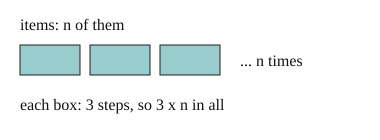

# 02 Counting steps in one loop

Part of [Counting Loop Steps](goal.md). Add `sure` or `guess` after any answer, and say `done` when finished.

## Your guess

Last time: a body of 3 steps runs once per item, over n items. How many steps in all? You said **b) n**. It is **c) 3n**.



- a) 3 counts one pass of the body.
- b) n counts the passes but not the steps in each.
- c) 3n: 3 steps in each of n passes.
- d) n cubed multiplies n by itself three times.

## The idea

To compare two pieces of code, you want a count that does not depend on the machine. Count passes, then steps per pass, and multiply: n passes of 3 steps is 3n (notes 3). For big-O, drop the fixed factor: 3n is O(n). A `range(a, b)` loop makes b - a passes (notes 1).

## Questions

**Q1.** How many times does the body of `for i in range(4, 20):` run?

Answer: 16

> **Feedback:** Right: 20 - 4 = 16 (notes 1).

**Q2.** A loop `for x in items:` has 2 steps in its body, and items holds n things. How many steps in all, and what is its big-O?

Answer: 2n steps, O(n)

> **Feedback:** Right: n passes of 2 steps, and big-O drops the 2 (notes 3).

**Q3.** Lee says `for i in range(0, n, 2):` with a 1-step body is O(n/2), so it beats O(n). What is wrong?

Answer: it is n/2 steps but that is still a fixed factor (one half) times n, so it is O(n)

> **Feedback:** Right: one half is a fixed factor, and big-O drops it (notes 3).

You can now count the steps of one loop and give its big-O.

## Guess for next time (not graded)

How many times does the inner line run?

```python
for i in range(3):
    for j in range(4):
        print(i, j)
```

- a) 7
- b) 12
- c) 3
- d) 4

Answer: a (sure)
