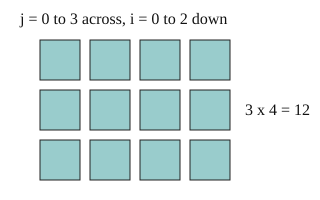

# 03 Nested loops

Part of [Counting Loop Steps](goal.md). Add `sure` or `guess` after any answer, and say `done` when finished.

## Your guess

Last time: how many times does `print(i, j)` run when `range(3)` holds `range(4)`? You said **a) 7**. It is **b) 12**.



- a) 7 adds the two counts, as if the loops ran one after the other.
- b) 12: the inner loop runs all 4 times for each of the 3 outer passes.
- c) 3 counts only the outer loop.
- d) 4 counts only the inner loop.

## The idea

When one loop sits inside another, each outer pass runs the whole inner loop, so the counts multiply (notes 4). Loops one after the other add instead (notes 5). Over n and n, inside means n x n, which is O(n^2).

## Questions

**Q1.** How many times does `total += 1` run?

```python
total = 0
for i in range(5):
    for j in range(5):
        total += 1
```

Answer: 25

**Q2.** In your own words: why is a loop over n inside another loop over n O(n^2), not O(2n)?

Answer: the inner loop runs all n times for each of the n outer passes, so the counts multiply to n x n. They would only add to 2n if one loop came after the other

**Q3.** Ana says this is O(n^2) because there are two loops. What is wrong?

```python
for i in range(n):
    for j in range(3):
        print(i, j)
```

Answer: the inner loop only ever runs 3 times, a fixed count, so it is 3n steps, which is O(n)
