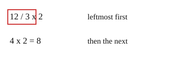

# 03 Left to right

Part of [Order of Operations](goal.md). Add `sure` or `guess` after any answer, and say `done` when finished.

## Your guess

Last time: what is 12 / 3 x 2? You said **c) 4**. It is **b) 8**.

- a) 2 multiplies first, then divides.
- b) 8: 12 / 3 = 4 first, then 4 x 2.
- c) 4 stops after the divide.
- d) 24 multiplies 12 by 2 and drops the 3.

## The idea

When two steps have the same rank, the rule from lesson 02 cannot pick one, so there must be a tie-break. Multiply and divide share a rank, and so do add and subtract: work each pair in one pass from left to right (notes 3, 4).

## Questions

**Q1.** What is 20 - 8 + 2?

Answer: 14 (sure)

> **Feedback:** Right: from the left, 20 - 8 = 12, then 12 + 2 = 14 (notes 4).

**Q2.** Jo says 24 / 4 x 2 = 3, since multiply comes before divide. What is wrong?

Answer: nothing, 4*2 comes first since multiply goes before divide, so it is 24/8 = 3 (sure)

> **Feedback:** You wrote `4*2 comes first since multiply goes before divide`. Try a case you can check by sense, 8 / 2 x 2, which is half of 8, doubled:
>
> - from the left: 8 / 2 = 4, then 4 x 2 = 8
> - multiply first: 2 x 2 = 4, then 8 / 4 = 2
>
> Halving and then doubling should land back on 8. Which order does that? (notes 3)

**Q3.** What is 40 / 2 / 2?

Answer: 40 / 2 = 20, then 20 / 2 = 10

> **Feedback:** You wrote "40". Two divides in a row also go from the left (notes 3). Take 36 / 3 / 3: first 36 / 3 = 12, then 12 / 3 = 4. Doing 3 / 3 first would give 36 / 1 = 36, as if nothing were divided. Now try Q3 the same way.

## Guess for next time (not graded)

What is 10 - (4 + 3)?

- a) 9
- b) 3
- c) 13
- d) 17

Answer: a (guess)
