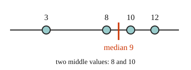

# 02 Mean and median

Part of [Mean and Median](goal.md). Add `sure` or `guess` after any answer, and say `done` when finished.

## Your guess

Last time: which number is the median of 3, 8, 10 and 12? You said **c) 10**. It is **a) 9**.

- a) 9: halfway between the two middle values, 8 and 10.
- b) 8.25 is the mean, the total 33 shared over 4.
- c) 10 takes the upper of the two middle values.
- d) 8 takes the lower of the two middle values.

## The idea

A list of numbers is hard to take in at a glance, so we sum it up with one value near its center. The mean shares the total out equally: add the values and divide by how many there are (notes 1). The median is the middle value once the list is sorted, and with an even count it is halfway between the two middle values (notes 2).

## Questions

**Q1.** Find the mean of 14, 9, 22, 11 and 19.

Answer: 15 (sure)

> **Feedback:** Right: the total, 75, shared over 5 (notes 1).

**Q2.** Find the median of 31, 12, 27, 45, 19 and 40.

Answer: 29 (sure)

> **Feedback:** Right: sorted, the middle two are 27 and 31 (notes 2).

**Q3.** Jo says the median of 6, 2, 9 is 2, since 2 is in the middle. What is wrong?

Answer: the median is the middle once the list is sorted. Sorted it is 2, 6, 9, so the median is 6 (sure)

> **Feedback:** Right: sort first (notes 2).

You can now find the mean and the median of a list.

## Guess for next time (not graded)

Scores of 60, 70 and 80 have a mean of 70. A fourth score of 190 joins them. What is the new mean?

- a) 75
- b) 100
- c) 70
- d) 130

Answer: a (guess)
