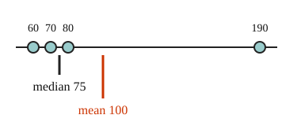

# 03 What an outlier does

Part of [Mean and Median](goal.md). Add `sure` or `guess` after any answer, and say `done` when finished.

## Your guess

Last time: 60, 70 and 80 have a mean of 70. A fourth score of 190 joins them. What is the new mean? You said **a) 75**. It is **b) 100**.

- a) 75 is the new median, halfway between 70 and 80.
- b) 100: the total, 400, shared over 4 scores.
- c) 70 keeps the old mean, as if one score cannot move it.
- d) 130 is halfway between the old mean and the new score.

## The idea

One value far from the rest, an outlier, can make a list look unlike its typical member. The mean puts the outlier's whole size into the total, so the outlier pulls the mean toward it. The median only cares about order: the outlier is one more value at the end, so the middle barely shifts (notes 3). Above, 190 pulled the mean from 70 to 100, but the median only went from 70 to 75.

## Questions

**Q1.** Five flats rent for 900, 950, 1000, 1050 and 3100 a month. What are the mean and the median?

Answer: mean 1400, median 1000 (sure)

**Q2.** Five houses on a street sold for 180, 190, 200, 210 and 720 thousand. Which is bigger here, the mean or the median? Explain why in your own words.

Answer: the mean is bigger. The mean is always bigger than the median, because it adds every value up, so it comes out bigger than one middle value (sure)

**Q3.** Raj says one very high value moves the median just as far as the mean. What is wrong?

Answer: the median only looks at which value is in the middle, so a very high value is just one more value at the top and the middle barely moves. The mean adds the whole value into the total, so it moves a lot (sure)

## Guess for next time (not graded)

Most workers at a small firm earn about 30 thousand a year, and the owner earns 400 thousand. Which number best describes what a typical person there earns?

- a) the mean
- b) the median
- c) the largest value
- d) halfway between the smallest and the largest

Answer: b (guess)
