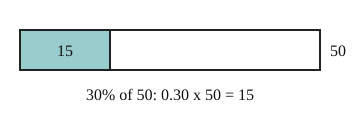

# 02 Percent of a number

Part of [Percent Change](goal.md). Add `sure` or `guess` after any answer, and say `done` when finished.

## Your guess

Last time: what is 30% of 50? You said **a) 20**. It is **b) 15**.

- a) 20 takes 30 away from 50.
- b) 15: 30% is 0.30, and 0.30 x 50 = 15.
- c) 1.5 uses 0.03 in place of 0.30.
- d) 80 adds 30 to 50.

## The idea

You often need a part of an amount, like a tip or a discount. Percent means per hundred, so 30% is 0.30 (notes 1). To take a percent of a number, multiply by that decimal (notes 2).

## Questions

**Q1.** What is 20% of 85?

Answer: 17 (sure)

> **Feedback:** Right: 0.20 x 85 = 17 (notes 2).

**Q2.** Why is 5% of 60 the same as 60% of 5?

Answer: both are 0.05 x 60 and 0.6 x 5, which are both 3, the order you multiply in does not matter

> **Feedback:** Right: each is 5 x 60 / 100 (notes 2).

**Q3.** Sam says 150% of 40 is impossible, since you cannot have more than all of something. What is wrong?

Answer: 150% is just 1.5 x 40 = 60, a percent can go over 100 (sure)

> **Feedback:** Right: 150 per hundred is 1.5 (notes 1).

You can now find any percent of a number.

## Guess for next time (not graded)

A price goes from 80 to 100. By what percent did it rise?

- a) 20%
- b) 25%
- c) 80%
- d) 125%

Answer: a (guess)
