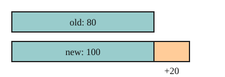

# 03 Percent change

Part of [Percent Change](goal.md). Add `sure` or `guess` after any answer, and say `done` when finished.

## Your guess

Last time: a price goes from 80 to 100. By what percent did it rise? You said **a) 20%**. It is **b) 25%**.

- a) 20% is the change, 20, read as a percent.
- b) 25%: the change, 20, is 25 per hundred of the old 80.
- c) 80% compares the old price to the new one.
- d) 125% is the new price as a percent of the old.

## The idea

A rise of 20 means a lot on a price of 80 and little on a price of 8000. To compare changes, measure each against where it started (notes 4):

$$
\text{percent change} = \frac{\text{new} - \text{old}}{\text{old}} \times 100
$$

A negative result is a decrease (notes 3).

## Questions

**Q1.** A bike's price goes from 250 to 300. What is the percent increase?

Answer: (300 - 250) / 250 = 50 / 250 = 0.25, so 25% (sure)

**Q2.** A town shrinks from 800 to 600 people. What is the percent change?

Answer: (600 - 800) / 800 = -200 / 800 = -0.25, so -25% (sure)

**Q3.** In your own words: why do you divide by the old value and not the new one?

Answer:

## Guess for next time (not graded)

A coat's price rose 25% to 100. What was the price before?

- a) 75
- b) 80
- c) 125
- d) 120

Answer: a (guess)
