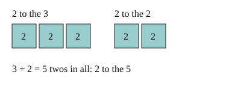

# 02 Multiplying powers

Part of [Exponent Rules](goal.md). Add `sure` or `guess` after any answer, and say `done` when finished.

Help is now 3: each lesson traces a worked example before the questions.

## Your guess

Last time: which is $2^3 \times 2^2$? You said **b) $2^5$**, and it is.

- a) $2^6$ multiplies the exponents.
- b) $2^5$: three 2s and two more 2s make five 2s.
- c) $4^5$ adds the exponents but multiplies the bases.
- d) $4^6$ multiplies the bases and the exponents.

## The idea

Writing out every copy gets long fast. But a power just counts copies (notes 1), so two powers of the same base side by side just add their counts, and the base stays the same (notes 2):

$$
a^m \times a^n = a^{m+n}
$$

Worked example: $5^2 \times 5^3$.

- $5^2$ is two 5s, and $5^3$ is three 5s
- side by side, that is five 5s
- so $5^2 \times 5^3 = 5^5$

## Questions

**Q1.** Write $7^3 \times 7^4$ as one power.

Answer: 7^7

> **Feedback:** Right: 3 + 4 = 7 copies of 7 (notes 2).

**Q2.** In your own words: why does $x^2 \times x^5$ add the exponents?

Answer: x^2 is two x's and x^5 is five x's, so multiplied together it is seven x's in a row, x^7

> **Feedback:** Right: the copies line up, so their counts add (notes 2).

**Q3.** Jo says $3^2 \times 3^3 = 9^5$. What is wrong?

Answer: the base stays 3, you only add how many 3s there are, so it is 3^5 not 9^5

> **Feedback:** Right: only the counts add, the base stays 3 (notes 2).

You can now multiply powers of the same base.

## Guess for next time (not graded)

Which is $(2^3)^2$?

- a) $2^5$
- b) $2^6$
- c) $2^9$
- d) $4^3$

Answer: b (guess)
