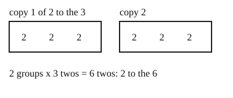

# 03 Power of a power

Part of [Exponent Rules](goal.md). Add `sure` or `guess` after any answer, and say `done` when finished.

## Your guess

Last time: which is $(2^3)^2$? You said **b) $2^6$**, and it is.

- a) $2^5$ adds the exponents, as when multiplying powers.
- b) $2^6$: two groups of three 2s make six 2s.
- c) $2^9$ squares the exponent instead of doubling it.
- d) $4^3$ squares the base instead of the power.

## The idea

A power of a power is copies of copies. $(a^m)^n$ is n copies of $a^m$, and each holds m copies of a, so there are m x n copies in all (notes 3):

$$
(a^m)^n = a^{m \times n}
$$

Worked example: $(3^2)^4$.

- four copies of $3^2$
- each holds two 3s
- 4 x 2 = 8 threes, so $3^8$

## Questions

**Q1.** Write $(5^2)^3$ as one power.

Answer: 5^6

> **Feedback:** Right: three copies of two 5s, 3 x 2 = 6 (notes 3).

**Q2.** Write $(x^4)^2$ as one power.

Answer: x^8 (sure)

> **Feedback:** Right: two copies of four x's, 2 x 4 = 8 (notes 3).

**Q3.** In your own words: why is $(a^2)^3$ equal to $a^6$ and not $a^5$?

Answer: it is three copies of a^2 multiplied, so 2 + 2 + 2 = 6 a's. You only get 5 when you multiply a^2 by a^3

> **Feedback:** Right: three copies of two a's is 6, while $a^2 \times a^3$ is a different sum (notes 2, 3).

You can now raise a power to a power.

## Guess for next time (not graded)

Going down from $2^3 = 8$ to $2^2 = 4$ to $2^1 = 2$, what is $2^0$?

- a) 0
- b) 1
- c) 2
- d) it has no value

Answer: a (sure)
