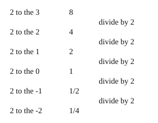

# 04 Negative exponents

Part of [Exponent Rules](goal.md). Add `sure` or `guess` after any answer, and say `done` when finished.

Help is down to 2, since 02 and 03 both passed first try: an outline and a picture, no worked example.

## Review

**R1.** Which is $6^2 \times 6^5$?

- a) $36^7$
- b) $6^{10}$
- c) $6^7$
- d) $12^7$

Answer:

## Your guess

Last time: going down from $2^3 = 8$, what is $2^0$? You said **a) 0**. It is **b) 1**.

- a) 0 reads zero copies as nothing left.
- b) 1: each step down divides by 2, and 2 / 2 = 1.
- c) 2 stops one step too early.
- d) no value treats zero copies as undefined.

## The idea

"A power counts copies" stops making sense at zero copies, or fewer. Keep the pattern instead: each step down in the exponent divides by the base once more (notes 4). Keep going past 0 and you get one over a power (notes 5):

$$
a^{-n} = \frac{1}{a^n}
$$

Outline:

- start from a power you know
- step down one at a time, dividing by the base each step
- a minus in the exponent gives a small positive number, not a negative one

## Questions

**Q1.** What is $3^{-2}$, as a fraction?

Answer:

**Q2.** In your own words: why is $5^{-1}$ equal to one fifth, and not -5?

Answer:

**Q3.** Rae says $10^{-3}$ is -1000, since the minus sign makes it negative. What is wrong?

Answer:
