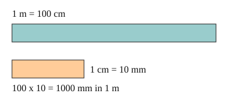

# 02 Length units

Part of [Metric Units](goal.md). Add `sure` or `guess` after any answer, and say `done` when finished.

## Your guess

Last time: how many mm are in 1 m? You said **a) 100**. It is **b) 1000**.

- a) 100 counts the cm in a metre, not the mm.
- b) 1000: 100 cm, each of 10 mm, makes 100 x 10.
- c) 10 counts the mm in one cm.
- d) 10,000 multiplies 100 by 100.

## The idea

A pencil is about 15 cm, a room about 4 m, a town about 3 km: each unit fits a different size of thing. Metric units step by fixed factors (notes 1): 10 mm make a cm, 100 cm make a m, and 1000 m make a km. To go across two steps, multiply the two factors.

## Questions

**Q1.** How many cm are in 4 m?

Answer: 400

> **Feedback:** Right: 4 x 100 = 400 (notes 1).

**Q2.** How many m are in 3 km?

Answer: 3000

> **Feedback:** Right: 3 x 1000 = 3000 (notes 1).

**Q3.** Ravi says there are 100 mm in a cm, since there are 100 cm in a m. What is wrong?

Answer: each step has its own factor. A cm is only 10 mm (sure)

> **Feedback:** Right: 1 cm = 10 mm, and 100 is the cm to m factor (notes 1).

You can now say how many of each smaller metric unit fit in a bigger one.

## Guess for next time (not graded)

Change 2.5 m into cm.

- a) 25
- b) 250
- c) 0.025
- d) 2500

Answer: b (sure)
