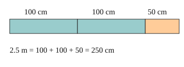

# 03 Converting lengths

Part of [Metric Units](goal.md). Add `sure` or `guess` after any answer, and say `done` when finished.

## Your guess

Last time: change 2.5 m into cm. You said **b) 250**, and it is.

- a) 25 multiplies by 10, the mm to cm factor.
- b) 250: each metre is 100 cm, so 2.5 x 100.
- c) 0.025 divides by 100 instead of multiplying.
- d) 2500 multiplies by 1000, the m to km factor.

## The idea

A length does not change when you change its unit, only the count does. A smaller unit fits more times, so going to a smaller unit you multiply by the factor, and going to a bigger unit you divide (notes 2, 3).

## Questions

**Q1.** Change 3.2 km into m.

Answer: 3200 (sure)

**Q2.** Change 450 mm into cm.

Answer: 45

**Q3.** In your own words: why do you multiply when you change m into cm?

Answer: a cm is smaller, so more of them fit in the same length, 100 for every metre

## Guess for next time (not graded)

A square is 1 m on each side. What is its area in cm²?

- a) 100
- b) 10,000
- c) 1000
- d) 400

Answer: a (sure)
